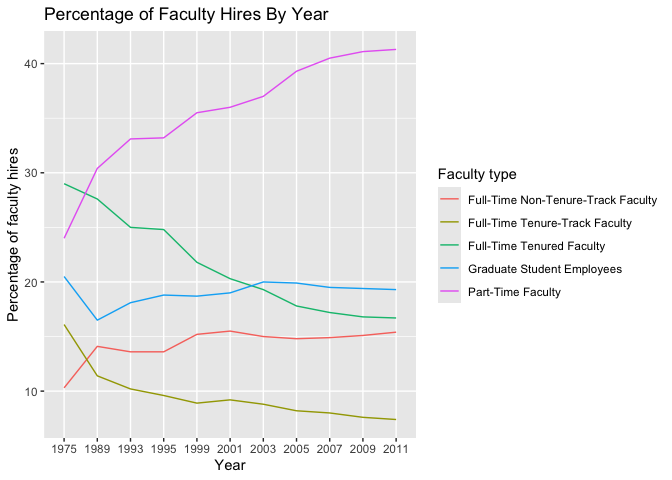
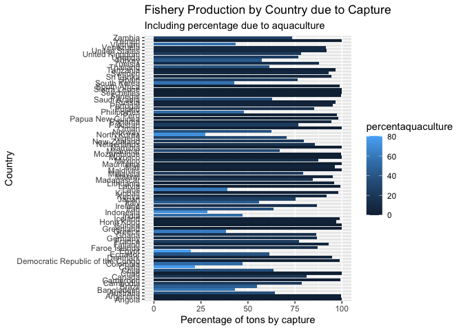

Lab 06 - Ugly charts and Simpson’s paradox
================
Charlize Ezernack
Insert date here

### Load packages and data

``` r
library(tidyverse) 
library(dsbox)
library(mosaicData) 
staff <- read_csv("data/instructional-staff.csv")
```

### Exercise 1

``` r
staff_long <- staff %>%
  pivot_longer(cols = -faculty_type, names_to = "year") %>%
  mutate(value = as.numeric(value))
```

``` r
staff_long %>%
  ggplot(aes(
    x = year,
    y = value,
    group = faculty_type,
    color = faculty_type,
  
  )) +
  geom_line() + labs(x = "Year", y = "Percentage of faculty hires", title = "Percentage of Faculty Hires By Year", col = "Faculty type") 
```

<!-- -->

### Exercise 2

I feel like this graph is pretty representative of Part-Time Faculty
members going up over time compared to the others; however, if I could
make a change maybe I would recommend using points in order to clearly
identify which percentages are being connected with the line.

### Exercise 3

``` r
fisheries <- read_csv("data/fisheries.csv")
```

    ## Rows: 216 Columns: 4
    ## ── Column specification ────────────────────────────────────────────────────────
    ## Delimiter: ","
    ## chr (1): country
    ## dbl (3): capture, aquaculture, total
    ## 
    ## ℹ Use `spec()` to retrieve the full column specification for this data.
    ## ℹ Specify the column types or set `show_col_types = FALSE` to quiet this message.

In this plot/pie chart it is very visually difficult to understand the
trends that are occurring, and how each countries vary from the other.
In order to improve this important aspect of data visualization I feel
that at the very least it should be separated by capture and
aquaculture, but perhaps represented by percentages.

``` r
fisheries <- fisheries %>% filter(total> 100000) %>% mutate(percentcapture = ((capture/total) * 100), percentaquaculture = ((aquaculture/total)* 100))
```

- The first change I made to the data was calculating the percentages
  for two columns, capture and aquaculture, and I also filtered out rows
  with a total less than 100,000 tons which the original example did as
  well. Doing this will hopefully allow for better numbers to use on a
  distribution.

``` r
fisheries %>% ggplot(aes(x= country, y = percentcapture, fill = percentaquaculture)) + geom_col() + coord_flip() + labs(x = "Country", y = "Percentage of tons by capture", title = "Fishery Production by Country due to Capture",subtitle = "Including percentage due to aquaculture", col = "Percent due to aquaculture") 
```

    ## Ignoring unknown labels:
    ## • colour : "Percent due to aquaculture"

<!-- -->

The additions I added:

1)  switching the country labels to y-axis
2)  utilizing columns to clearly see which countries are performing the
    best than others
3)  utilizing the x axis in conjuction with a fill in order to represent
    both percentages of capture and aquaculture to production.

This dataset has 82 countries so the y-axis is definitely all up on each
other, so if needed maybe there is a way to split up the data set? I am
not completely sure on that aspect, but I do understand how packed the
distribution looks. However, I do feel as if it is an improvement in
seeing more clearly the trends that are occurring and how each country
varies from the other, which was my goal from the start:)
